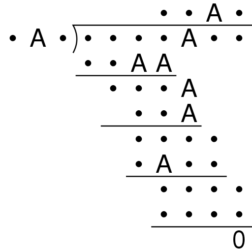

# feynman-long-division

A computational approach to Feynamn's long division problem.

## The Problem

Feynman once posed this
puzzle: the As all represent
the same digit, and the
dots each represent some
digit, but not the same as
the As.
What are the divisor and
quotient?

